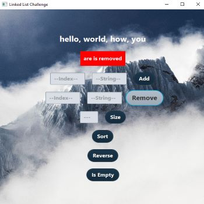
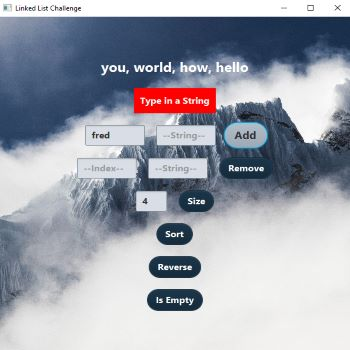
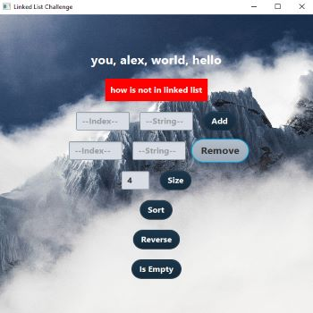
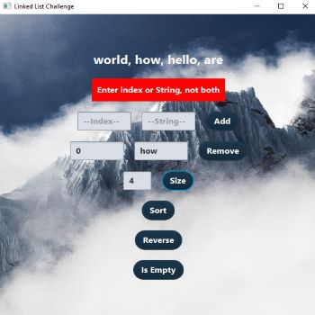
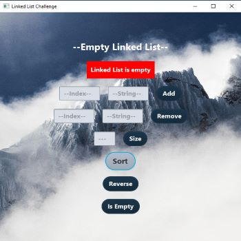

<h1 align="center">Welcome to Double Linked List</h1>

<!--  -->

<h4 align="center">
  Javafx: type in a value at a given index.  Pressing the add button will add it to the double linked list. Type in a value at a given index and pressing the remove button will remove the item. This program uses a double linked list to sort the list and reverse it.  
</h4>
 

<h2 align="center" style="text-decoration: underline;">Using this GUI is as follows:</h2>

<h4 align="center">
    1. Either type in an index and string to add, or leave Index blank and just type in a String.  Clicking on the Add button will add the item to the double linked list.  Repeat as many times as you would like.

</h4>

<h4 align="center">
    2. Enter in a Index to remove.  Click on remove to remove a item from the double linked list.  You can also type in a String to remove if it exists in the double linked list.  The item that was removed will be displayed.

</h4>

<h4 align="center">
    3. Clicking on the Size button will display how many items are in the double linked list.

</h4>

<h4 align="center">
    4. Clicking on the Sort button will sort the double linked list in ascending order then display it.

</h4>

<h4 align="center">
    5. Clicking on the Reverse button will reverse the double linked list then display it.
    

</h4>

<h4 align="center">
    6. Clicking on the Is Empty button will display if the double linked list is empty or not.

</h4>

<h2 align="center" style="text-decoration: underline;">Errors:</h2>

<h4 align="center">
    1. A String must be typed in the String textfield to be added.

</h4>

<h4 align="center">
    2. Only a integer must be typed in the Index textfield.

</h4>

<h4 align="center">
    3. The integer typed in the add textfield must not be greater than the size of the double linked list.

</h4>

<h4 align="center">
    4. If a value typed in the String textfield to remove does not exist in the double linked list, then a error message will be displayed.

</h4>

<h4 align="center">
    5. The integer typed in the remove textfield must not be greater than the size of the double linked list.
    

</h4>

<h4 align="center">
    6. If the Index AND String textfield are empty but the Remove button is clicked, a error message will be displayed.

</h4>

<h4 align="center">
    7. If a value is typed in the Index AND String textfield to be removed, by clicking on the Remove button will display a error message.  Please choose either a Index or String to remove, not both at the same time.

</h4>

<h4 align="center">
    8. If the double linked list is empty and the Sort button is pressed, a error message will be displayed.  Please add items to the double linked list before sorting.

</h4>

<!-- For more details see [GitHub Flavored Markdown](https://guides.github.com/features/mastering-markdown/). -->
<!-- You can use the [editor on GitHub](https://github.com/zuki07/Linked_list/edit/gh-pages/index.md) to maintain and preview the content for your website in Markdown files. -->
